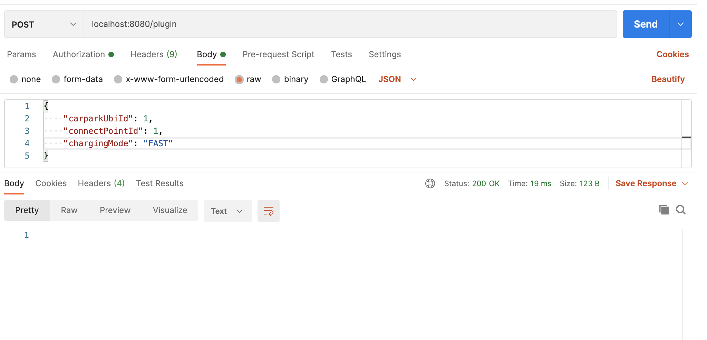
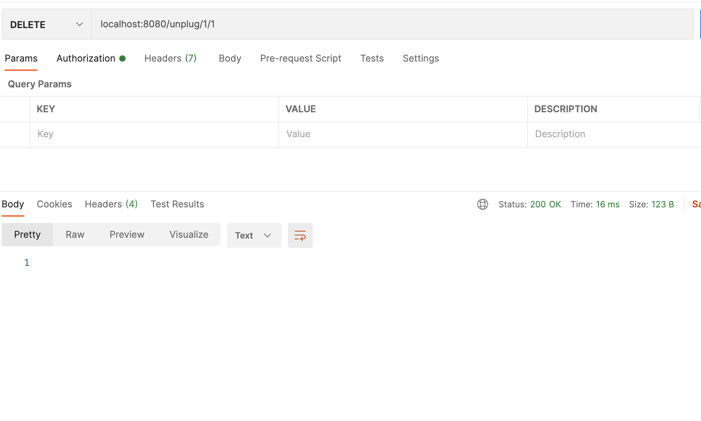
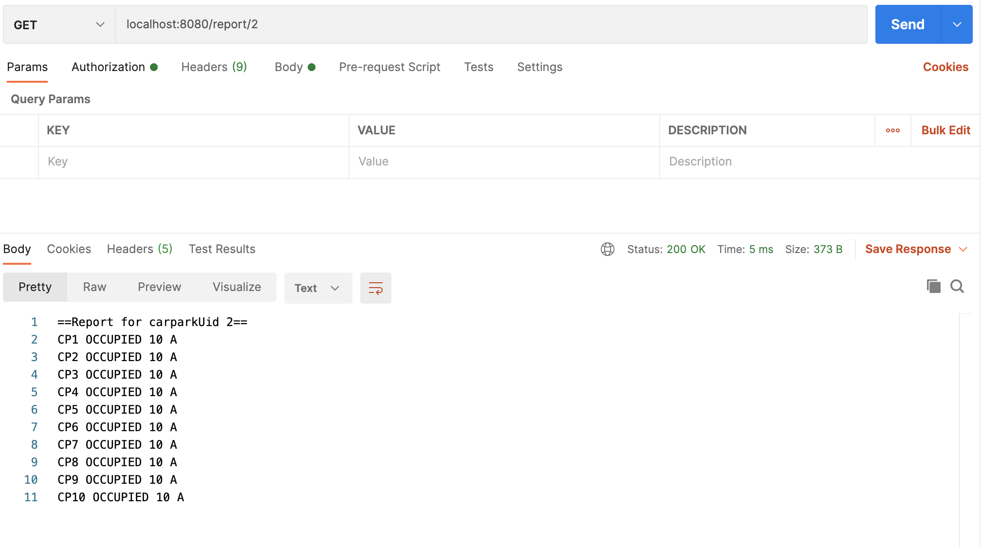

# Coding Challenge
This is the challenge project of Ibrahim AVCI, created based on the requirements defined in
https://github.com/ubitricity/coding-challenge.
I used IntelliJ IDE for development. Infrastructure is created over Spring Boot, Lombok and RESTFul services.

#### Building & Running Over Script File with in ease

1.  Execute the `./build-all.sh` shell script in the root directory of project in the terminal.
    This will run maven and install the application, afterwards docker compose
    will run. The docker container will be up.
    Please wait a little while to see check it on Postman.

2.  When the project boot up, we store 2 station as default,It is configurable from application.properties file. (carparkubi.count=2)
    Each of these stations will have 10 charge points.

3.  You can call localhost:8080/plugin endpoint to station 1 or station 2. (I called this stations CarParkUbi)
    `{
    "carparkUbiId": 1,
    "connectPointId": 1,
    "chargingMode": "FAST"
    }`
    

4. You can call localhost:8080/unplug/{carparkUbiId}/{chargingPointId} endpoint to unplug your car from station 1 and from char point 1
   

5. You can get report of the station with calling CarParkUbi station Id such as localhost:8080/report/{carparkUbiId}
   